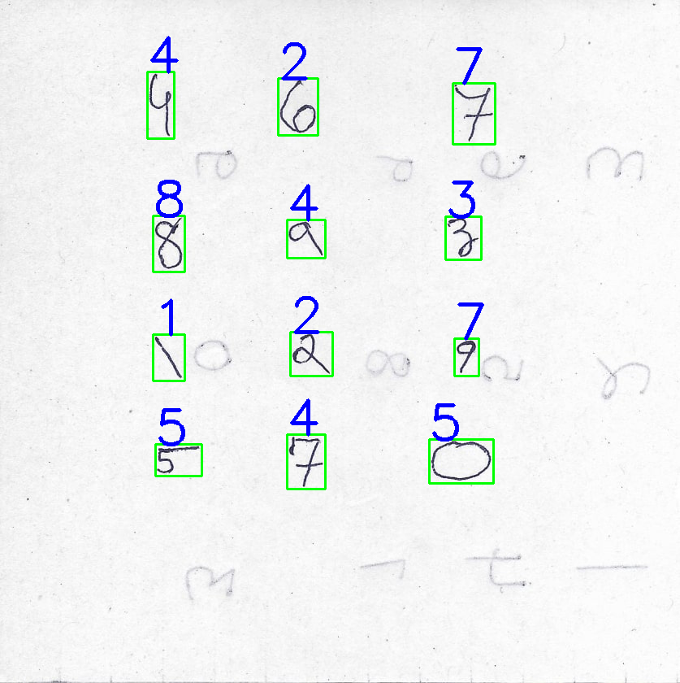

# Hand Digit Recognition
Handwritten Digit Recognition using OpenCV & CNN | [Demo](https://hand-digit-recog.herokuapp.com/) | [Video](https://drive.google.com/file/d/1qyqxktRFp_0fYvHLOq11HHdX5y0w7jR0/view)

# Dependencies
1. `opencv-python==3.4.2.17`
2. `scipy==1.4.1`
3. `scikit-image==0.17.2`
4. `numpy==1.19.1`
5. `tensorflow-cpu`
6. `keras`
7. `gunicorn`
8. `pillow==6.2.2`

## Local Usage 

* Clone the repository - 
```bash
git clone https://github.com/minithbjain/hand-digit-recog.git
cd hand-digit-recog
```
* Install dependencies
```python
pip install -r requirements.txt
```
* Run App
```python
python app.py
```
* Open browser, go to  http://localhost:5000

## Result sample

